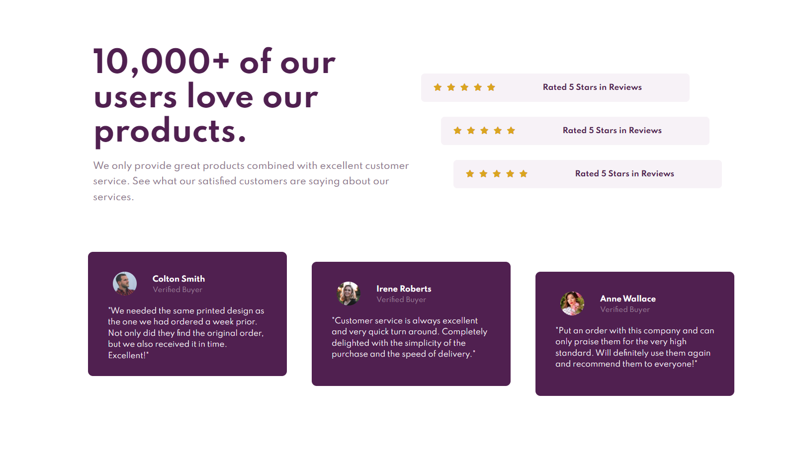

# Frontend Mentor - Social proof section solution

This is a solution to the [Social proof section challenge on Frontend Mentor](https://www.frontendmentor.io/challenges/social-proof-section-6e0qTv_bA). Frontend Mentor challenges help you improve your coding skills by building realistic projects. 

## Table of contents

- [Overview](#overview)
  - [The challenge](#the-challenge)
  - [Screenshot](#screenshot)
  - [Links](#links)
- [My process](#my-process)
  - [Built with](#built-with)
  - [What I learned](#what-i-learned)
  - [Continued development](#continued-development)
  - [Useful resources](#useful-resources)
- [Author](#author)

## Overview

### The challenge

Users should be able to:

- View the optimal layout for the section depending on their device's screen size

### Screenshot



### Links

- Solution URL: (https://github.com/Ando96/social-proof-section-master)
- Live Site URL: (https://ando96.github.io/social-proof-section-master/)

## My process

### Built with

- Semantic HTML5 markup
- CSS custom properties
- Flexbox

### What I learned

Still learning how to use flexbox properly, I feel like I learnt alot from this challenge such as nesting flexbox containers to achieve the layout I want.

```css
.container {
  display: flex;
}
```

### Continued development

I am still working through these front end mentor challenges to improve my HTML and CSS, while I feel I still struggle a bit when I first start and sometimes look
at completed solutions I've improved alot from when I first started - I couldn't even remember how to align content into the centre of the page on my first one. 
I just need to break through this mindset that I can't do it.

### Useful resources

- [w3schools] https://www.w3schools.com/css/default.asp - Has everything you need when it comes to HTML and CSS basics
- [MDN] https://developer.mozilla.org/en-US/- Has a lot of useful and interesting information about the different HTML and CSS tags, I find a new attribute or tag everytime I'm looking for something

## Author

- Frontend Mentor - [@Ando96](https://www.frontendmentor.io/profile/Ando96)
